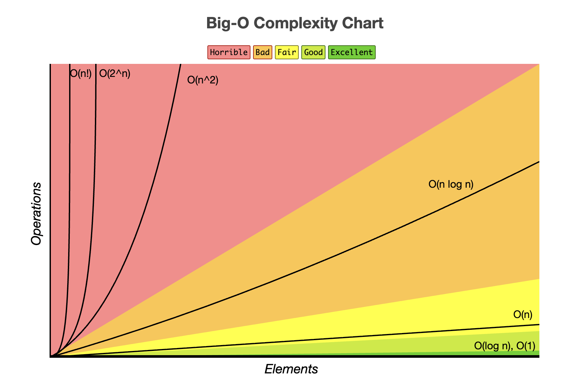

# 01. Time & Space Complexity

When writing code, two big questions matter:

- How fast does it run? **Time Complexity**
- How much memory does it use? **Space Complexity**

We use **Big O Notation** to describe this performance in a standardized way.

## What is Big O Notation?

Big O helps us measure:

- **Time** - number of operations (speed).
- **Space** - memory usage.

The **O** means "order of". and **n** usually means "size of input".



Example:

- `O(n)` → grows **linearly** with input.
- `O(1)` → constant, does not depend on input.

## Time Complexity

Time complexity in Big O notation is a measure of how an algorithm’s running time increases with the size of its input. It provides an estimate of the worst-case time required to execute an algorithm as a function of the input size.

1. **O(1) – Constant Time**

   The algorithm’s running time does not depend on the size of the input; it performs a fixed number of operations.

   ```js
   function getFirstElement(arr) {
     return arr[0]; // always 1 step
   }
   ```

2. **O(log n) – Logarithmic Time**

   The algorithm’s running time grows logarithmically with the size of the input.

   ```js
   function binarySearch(arr, target) {
     let left = 0,
       right = arr.length - 1;
     while (left <= right) {
       let mid = Math.floor((left + right) / 2);
       if (arr[mid] === target) return mid;
       else if (arr[mid] < target) left = mid + 1;
       else right = mid - 1;
     }
     return -1;
   }
   ```

3. **O(n) – Linear Time**

   The algorithm’s running time scales linearly with the size of the input.

   ```js
   function sumArray(arr) {
     let sum = 0;
     for (let num of arr) {
       sum += num; // runs "n" times
     }
     return sum;
   }
   ```

4. **O(n²) – Quadratic Time**

   The algorithm’s running time is directly proportional to the square of the input size.

   ```js
   function printPairs(arr) {
     for (let i = 0; i < arr.length; i++) {
       for (let j = 0; j < arr.length; j++) {
         console.log(arr[i], arr[j]); // runs n * n times
       }
     }
   }
   ```

5. **O(2ⁿ) – Exponential Time**

   The algorithm’s running time doubles with each increase in the input size.

   ```js
   function fibonacci(n) {
     if (n <= 1) return n;
     return fibonacci(n - 1) + fibonacci(n - 2); // explodes fast
   }
   ```

6. **O(n!) – Factorial Time**

   The algorithm’s running time is directly proportional to the factorial of the input size.

   ```js
   function permute(str) {
     if (str.length <= 1) return [str];
     let result = [];
     for (let i = 0; i < str.length; i++) {
       let char = str[i];
       let rest = str.slice(0, i) + str.slice(i + 1);
       for (let perm of permute(rest)) {
         result.push(char + perm);
       }
     }
     return result;
   }
   ```

## Space Complexity Examples

Space complexity in Big O notation measures the amount of memory used by an algorithm with respect to the size of its input. It represents the worst-case memory consumption as the input size increases

### 1. **O(1) – Constant Space**

The algorithm uses a fixed amount of memory that does not depend on the input size.

```js
function multiply(a, b) {
  return a * b; // no extra memory
}
```

### 2. **O(n) – Linear Space**

The algorithm’s memory usage grows linearly with the input size.

```js
function createArray(n) {
  let result = [];
  for (let i = 0; i < n; i++) {
    result.push(i); // storing "n" items
  }
  return result;
}
```

### 3. **O(n²) – Quadratic Space**

The algorithm’s memory usage increases proportionally to the square of the input size.

```js
function createMatrix(n) {
  let matrix = [];
  for (let i = 0; i < n; i++) {
    matrix.push(new Array(n).fill(0));
  }
  return matrix;
}
```

## Rules of Big O

1. **Constants are ignored**
   - `5n² + 6n + 4` → `n² + n + 1`
   - We only care about the rate of growth
2. **Drop lower order terms**
   - `n² + n + 1` → `n²`
   - As `n` grows large the larger term dominates all other terms
3. **Variables are combined only if they refer to the same input**
   - `5m + 6n` not `n`
   - `m² * n` not `n²`
4. **Always assume worst case analysis**
   - In some cases where the worst case analysis is not likely the average case is fine.

## Time vs Space Tradeoff

- Sometimes we use **more memory** to make an algorithm **faster**.
- Example: caching previous results of expensive calculations.

  ```js
  // Without caching (slow)
  function factorial(n) {
    if (n === 0) return 1;
    return n * factorial(n - 1);
  }

  // With caching (faster but more space)
  let memo = {};
  function factorialMemo(n) {
    if (n in memo) return memo[n];
    if (n === 0) return 1;
    return (memo[n] = n * factorialMemo(n - 1));
  }
  ```
