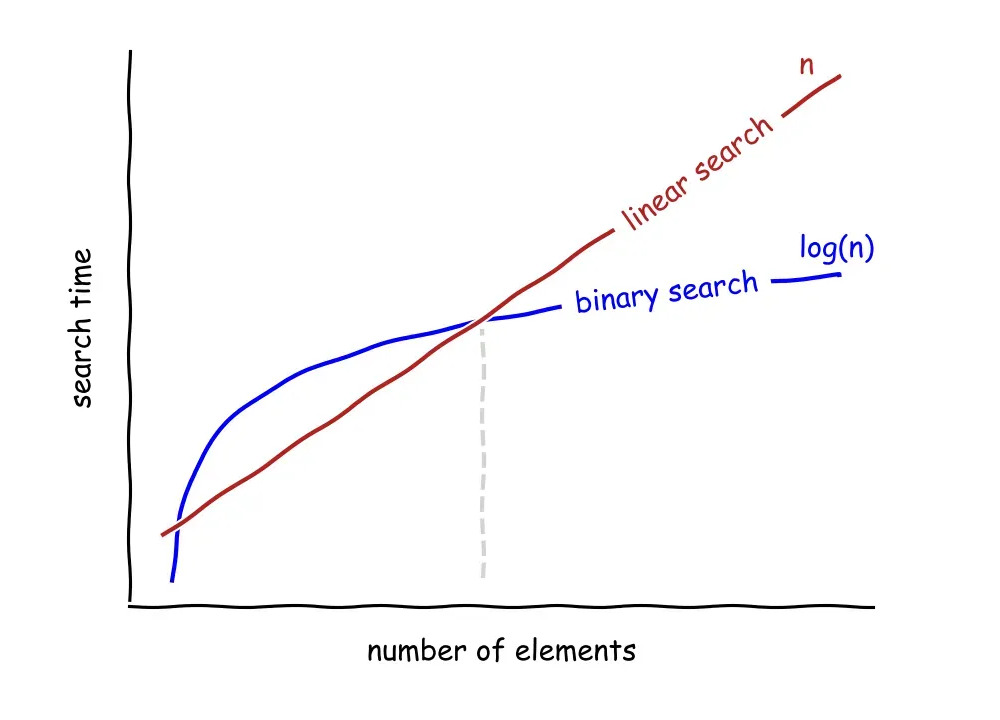

# 01. Time Complexity

It is used to measure efficiency of an algorithm in terms of speed of execution as the size of the input increases.

> Time complexity is not equal to Time taken to execute an algorithm.

| **Linear Search**                   | **Binary Search**                                   |
| ----------------------------------- | --------------------------------------------------- |
| `arr = [2, 1, 3, 8, 5, 4, 7]`       | `arr = [1, 2, 3, 4, 5, 7, 8]` (must be **sorted**)  |
| `search(5)`                         | `search(5)`                                         |
| Elements = `n`                      | Elements = `n`                                      |
| Iterations = up to `n` (worst case) | Iterations ≈ `log₂(n)` (each step halves the array) |
| Time Complexity = **n times**       | Time Complexity = **log₂(n) times**                 |

### Linear and Binary Search time complexity

<!-- adjust width of image -->

