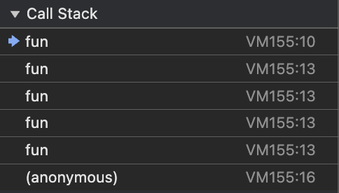
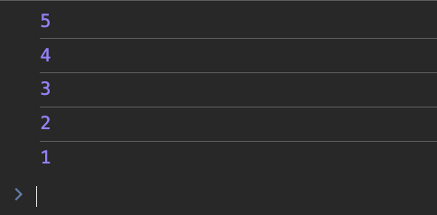

# 01. Recursion 101

> A recursive function is a function that calls itself to solve smaller subproblems of the same task.

## Two Key Parts of Recursion:

1. **Base Case** – A stopping condition that tells the function when to stop calling itself.
2. **Recursive Case** – The part where the function calls itself with a modified (usually smaller or simpler) input.

## Real-World Analogies

- A **queue of people** where each person asks the next to move forward.
- **Comment threads** that branch into nested replies.
- **Organizational hierarchies** (manager → team lead → engineer).

## Recursion and the Call Stack

Every recursive call is pushed onto the call stack. When the base case is hit, the function calls start resolving and "unwinding" the stack.

### Recursive Case _without_ a Base Case

```javascript
function fun(num) {
  console.log(num);
  num -= 1;

  // Recursive Case without a base case!
  fun(num);
}

fun(5);
```

> This results in a **stack overflow** because there's no stop condition.

#### Output (truncated):

```
5
4
3
...
-1000
...
Maximum call stack size exceeded
```

### Recursive Case _with_ a Base Case

```javascript
function fun(num) {
  // Base Case
  if (num === 0) return;

  console.log(num);

  // Recursive Case
  fun(num - 1);
}

fun(5);
```

#### Output:

```
5
4
3
2
1
```

### Visualizing the Call Stack

```javascript
function fun(num) {
  if (num === 0) return;

  console.log(num);
  fun(num - 1);
}

fun(3);
```

Call Stack at `fun(3)`:

| Function Call     |
| ----------------- |
| fun(3)            |
| fun(2)            |
| fun(1)            |
| fun(0) ✅ returns |

> As each function resolves, it’s popped off the call stack.

| Call Stack Image                                          | Output Image                                       |
| --------------------------------------------------------- | -------------------------------------------------- |
|  |  |

## Problem 1: Print n to 1 using Recursion

```javascript
function printNto1(n) {
  if (n < 1) return;

  console.log(n);
  printNto1(n - 1);
}

printNto1(5);
```

#### Output:

```
5
4
3
2
1
```

---

## Problem 2: Print 1 to n using Recursion

```javascript
function print1toN(x, n) {
  if (x > n) return;

  console.log(x);
  print1toN(x + 1, n);
}

print1toN(1, 10);
```

#### Output:

```
1
2
3
4
5
6
7
8
9
10
```

## Common Mistakes in Recursion

1.  **Missing Base Case**

    - Leads to infinite recursion and stack overflow.

2.  **Not Modifying Input**

    - The function keeps calling itself with the same input, never reaching the base case.

3.  **Too Deep Recursion**

    - For large inputs (like `n > 10,000`), recursion can exceed the call stack limit. Use iteration instead.

4.  **Time Complexity Ignored**
    - Recursive functions can be inefficient (e.g., naive Fibonacci has exponential complexity). Optimize with memoization or dynamic programming.

## Where to Use Recursion

1. **Problems with Substructure**

   - The problem can be defined in terms of smaller instances of itself.
   - Example: Calculating factorial, Fibonacci numbers.

2. **Tree and Graph Traversals**

   - Traversing hierarchical or connected structures.
   - Examples:

     - Binary Tree (inorder, preorder, postorder)
     - N-ary trees
     - Depth-first search (DFS) in graphs

3. **Backtracking Problems**

   - Exploring all possible options and undoing choices (backtracking).
   - Examples:

     - Sudoku solver
     - N-Queens problem
     - Subset/Permutation/Combination generation

4. **Divide and Conquer Algorithms**

   - Breaking a problem into smaller parts, solving them independently, and combining the results.
   - Examples:

     - Merge Sort
     - Quick Sort
     - Binary Search

5. **Dynamic Programming (Top-Down)**

   - Solving overlapping subproblems using recursion + memoization.
   - Example:

     - Fibonacci (with memoization)
     - Longest Common Subsequence
     - 0/1 Knapsack
