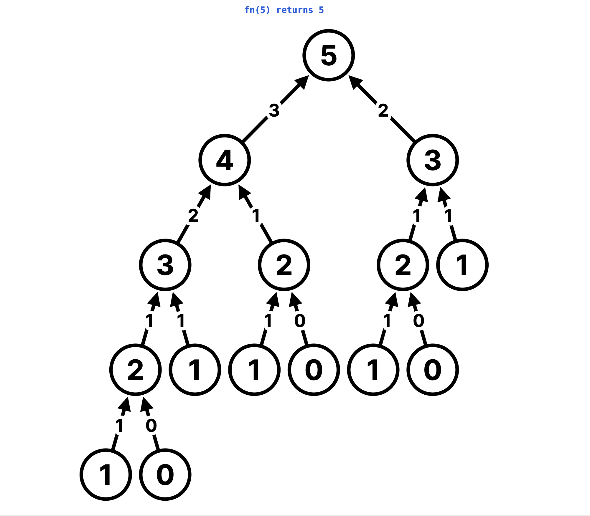

# [06. Recursion Masterclass](https://leetcode.com/problems/fibonacci-number/description/)

## Problem Statement:

### The Fibonacci numbers, commonly denoted `F(n)` form a sequence, called the Fibonacci sequence, such that each number is the sum of the two preceding ones, starting from `0` and `1`. That is,

> `F(0) = 0`, `F(1) = 1`
>
> `F(n) = F(n - 1) + F(n - 2), for n > 1`.

### Given `n`, calculate `F(n)`.

Example 1:

- Input: n = 2
- Output: 1
- Explanation: F(2) = F(1) + F(0) = 1 + 0 = 1.

Example 2:

- Input: n = 3
- Output: 2
- Explanation: F(3) = F(2) + F(1) = 1 + 1 = 2.

Example 3:

- Input: n = 4
- Output: 3
- Explanation: F(4) = F(3) + F(2) = 2 + 1 = 3.

## Approach 1: Iterative

1. Start with two variables, `first = 0` and `second = 1`, to represent `F(0)` and `F(1)`.

2. Loop from `2` to `n`, updating the next Fibonacci number as the sum of the previous two.

3. After each iteration, update `first` and `second`.

4. Return the last computed value.

### Complexity:

- **Time Complexity:** `O(n)`

- **Space Complexity:** `O(1)` (constant space)

### Logic Breakdown:

```javascript
function fibonacci(n) {
  // Edge Cases
  if (n === 0) return 0;
  else if (n === 1) return 1;

  let first = 0;
  let second = 1;
  let sum = 0;

  // Iterate from 2 to n
  for (let i = 2; i <= n; i++) {
    // Update the sum by adding (i-1)th and (i-2)th sums
    sum = first + second;

    // Update the first and second values
    first = second;
    second = sum;
  }

  return sum;
}
```

## Test Cases

```javascript
console.log(fibonacci(1)); // 1
console.log(fibonacci(3)); // 2
console.log(fibonacci(4)); // 3
```

## Approach 2: Recursive

1.  **Base Case:**

- If `n` is `0`, return `0`.
- If `n` is `1`, return `1`.

2.  **Recursive Case:**

- If `n` is greater than `1`, return `fibonacci(n - 1) + fibonacci(n - 2)`.



### Complexity

- **Time Complexity:** `O(2^n)`
  Due to overlapping sub-problems and exponential branching.

- **Space Complexity:** `O(n)`
  Due to the call stack depth.

### Logic Breakdown:

```javascript
function fibonacci(n) {
  // Base Case
  if (n === 0) return 0;
  else if (n === 1) return 1;

  // Recursive Case
  return fibonacci(n - 1) + fibonacci(n - 2);
}
```

## Test Cases

```javascript
console.log(fibonacci(1)); // 1
console.log(fibonacci(3)); // 2
console.log(fibonacci(4)); // 3
```
